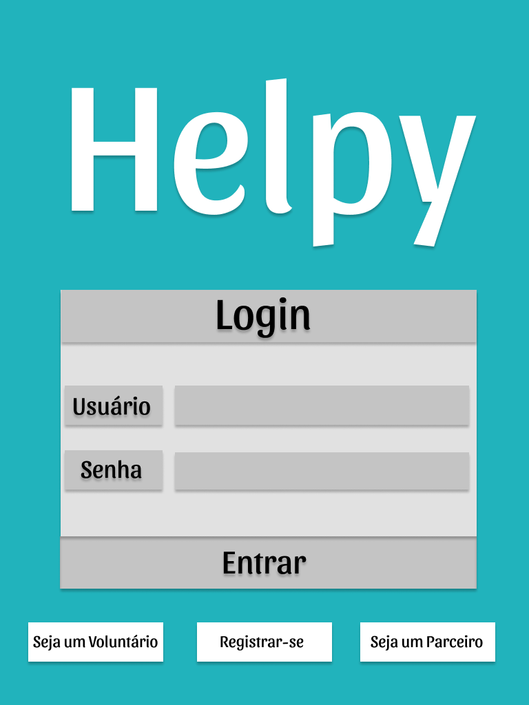
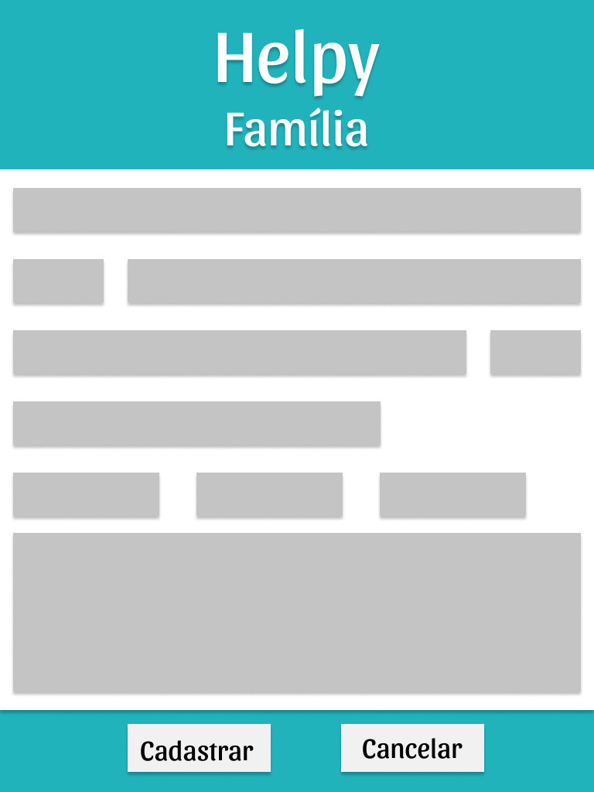

# Helpy

## Sumário
- [Helpy](#helpy)
  - [Sumário](#sumário)
  - [Versão](#versão)
  - [Sobre](#sobre)
  - [Documento de Visão](#documento-de-visão)
  - [Documento de Arquitetura](#documento-de-arquitetura)
  - [Wireframe](#wireframe)
  - [Autores](#autores)
  - [Orientador](#orientador)
  - [Conclusão](#conclusão)
  - [Licença](#licença)
  - [Referências](#referências)

## Versão

Versão: 1.0

## Sobre

Este foi um projeto da disciplina do 3° Semestre do curso de Análise de Desenvolvimento de Sistemas, disciplina de Design de Software, da Universidade Católica de Brasília-DF. Com a supervisão do professor André Gustavo.

O intuito do projeto era elaborar tanto um documento de visão quanto um de arquitetura. Exercitando os conhecimentos adiquiris das matérias anteriores de Engenharia de Software 1° semetres e Engenharia de Requisitos 2° Semestre. Além é claro , reforçar o trabalho em grupo e a pesquisa por conta própria.

No decorrer do trabalho conhecemos diversos conceitos alem de ferramentas que usamos e poderiamos usar no projeto. Foi um grande aprendizado. E todas as dúvidas eram prontamente sanadas pelo professor.

Apesar de não termos desenvolvido o software, aprendemos muito sobre a aréa de analise. Quem sabe futuramente possamos desenvolve-lo de fato.

Fique a vontade para qualquer feedback sobre o projeto.

## Documento de Visão

[DOCUMENTO DE VISÃO](DOCUMENTO-VISAO.md)

## Documento de Arquitetura

[DOCUMENTO DE ARQUITETURA](DOCUMENTO-ARQUITETURA.md)

## Wireframe

|    |   |   |    |
| ------------------------------------------------------------ | ------------------------------------------------------------ | ------------------------------------------------------------ | ------------------------------------------------------------ |
|   |   |   |   |
|   |  |  |  |
|  |

## Autores

<table>
  <tr>
    <td align="center">
      <a href="https://www.linkedin.com/in/gabriel-alves-de-paulo">
         
        
          <b>Gabriel Alves</b>
        
      </a>
    </td>
    <td align="center">
      <a href="https://www.linkedin.com/in/luiz-fernando-pereira-da-costa-57b678207/">
         
        
          <b>Luiz Fernando</b>
        
      </a>
    </td>
    <td align="center">
      <a href="https://www.linkedin.com/in/mateus-pereira-de-souza-moreira/">
         
        
          <b>Mateus Pereira</b>
        
      </a>
    </td>
    <td align="center">
      <a href="https://www.linkedin.com/in/raniery-azevedo-628945162/">
         
        
          <b>Raniery Pereira</b>
        
      </a>
    </td>
    <td align="center">
      <a href="https://www.linkedin.com/in/ruan-lucas-soares-do-nascimento-570543206/">
         
        
          <b>Ruan Lucas</b>
        
      </a>
    </td>
  </tr>  
</table>

## Orientador

<table>
  <tr>
    <td align="center">
      <a href="https://www.linkedin.com/in/andr%C3%A9-gustavo-bastos-lima-a1b344187/">
         
        
          <b>André Gustavo</b>
        
      </a>
    </td>
  </tr>  
</table>

## Conclusão

Ao termino desse trabalho, sabemos agora a grande importancia que o projeto bem documentado tem. Que contruir um software já sabendo de fato o que deve ser feito nos economiza muito tempo, além de evitar vários problemas que podemos detectar com os documentos mencionados no projeto.

Foi excelente trabalhar em grupo, e descutir vários conceitos, e aprender com a visão que cada um tem sobre deteminados temas. 

Agradecemos o professor por todas as duvídas tiradas e principalmente pelos conhecimentos passados dentro de sala. Obrigado!

## Licença

Esse projeto está sob licença. Veja o arquivo [LICENÇA](LICENSE.md) para mais detalhes.

## Referências

 - PRESSMAN, Roger. Engenharia de software. 8. Porto Alegre AMGH 2016
 - GUEDES, Gilleanes. UML 2 GUIA PRÁTICO. 2a Edição. São Paulo Novatec Editora 2014 
 - LUCIDCHART. O que é um Diagrama de Implantação. Disponivel em: <https://www.lucidchart.com/pages/pt/o-que-e-diagrama-de-implementacao-uml> Acesso em: 27/10/2020
 - FOWLER, Martin. UML essencial um breve guia para linguagem padrão. 3a Edição. Porto Alegre Bookman 2011
 - TOMAS, Anderson. O modelo 4 + 1. Disponivel:<http://tassinfo.com.br/orientacao-a-objeto/o-modelo-4-1/> Acesso: 15/17/2020
 - Material de apoio do Prof. André Gustavo Bastos Lima
